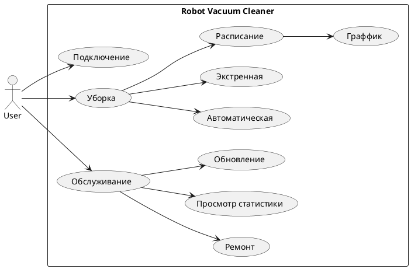

# UX/UI

Я написал базовый html
```html
<!DOCTYPE html>
<html lang="ru">
<head>
  <meta charset="UTF-8">
  <meta name="viewport" content="width=device-width, initial-scale=1.0">
  <title>Bootstrap Page</title>
  <link rel="stylesheet" href="<https://stackpath.bootstrapcdn.com/bootstrap/4.5.2/css/bootstrap.min.css>">
</head>
<body>
  <nav class="navbar navbar-expand-lg navbar-light bg-light">
<!--    <a class="navbar-brand" href="#"></a>-->
  </nav>

  <div class="container mt-4">
    <form>
      <div class="form-group">
        <label for="login">Логин</label>
        <input type="text" class="form-control" id="login" placeholder="Введите логин">
      </div>
      <div class="form-group">
        <label for="password">Пароль</label>
        <input type="password" class="form-control" id="password" placeholder="Введите пароль">
      </div>
      <button type="submit" class="btn btn-primary">Войти</button>
      <button type="button" class="btn btn-link">Зарегистрироваться</button>
    </form>
  </div>

  <script src="<https://code.jquery.com/jquery-3.5.1.slim.min.js>"></script>
  <script src="<https://cdn.jsdelivr.net/npm/popper.js@1.16.1/dist/umd/popper.min.js>"></script>
  <script src="<https://stackpath.bootstrapcdn.com/bootstrap/4.5.2/js/bootstrap.min.js>"></script>
</body>
</html>

```

```html
<!DOCTYPE html>
<html lang="ru">
<head>
  <meta charset="UTF-8">
  <meta name="viewport" content="width=device-width, initial-scale=1.0">
  <title>Регистрация</title>
  <link rel="stylesheet" href="<https://stackpath.bootstrapcdn.com/bootstrap/4.5.2/css/bootstrap.min.css>">
</head>
<body>
  <nav class="navbar navbar-expand-lg navbar-light bg-light">
<!--    <a class="navbar-brand" href="#"></a>-->
  </nav>

  <div class="container mt-4">
    <form>
      <div class="form-group">
        <label for="name">Имя</label>
        <input type="text" class="form-control" id="name" placeholder="Введите имя">
      </div>
      <div class="form-group">
        <label for="login">Логин</label>
        <input type="text" class="form-control" id="login" placeholder="Введите логин">
      </div>
      <div class="form-group">
        <label for="password">Пароль</label>
        <input type="password" class="form-control" id="password" placeholder="Введите пароль">
      </div>
      <div class="form-group">
        <label for="confirm-password">Подтверждение пароля</label>
        <input type="password" class="form-control" id="confirm-password" placeholder="Подтвердите пароль">
      </div>
      <div class="form-group">
        <label for="email">Email</label>
        <input type="email" class="form-control" id="email" placeholder="Введите email">
      </div>
      <button type="submit" class="btn btn-primary">Регистрация</button>
    </form>
  </div>

  <script src="<https://code.jquery.com/jquery-3.5.1.slim.min.js>"></script>
  <script src="<https://cdn.jsdelivr.net/npm/popper.js@1.16.1/dist/umd/popper.min.js>"></script>
  <script src="<https://stackpath.bootstrapcdn.com/bootstrap/4.5.2/js/bootstrap.min.js>"></script>
</body>
</html>

```

```html
<!DOCTYPE html>
<html lang="ru">
<head>
    <meta charset="UTF-8">
    <meta name="viewport" content="width=device-width, initial-scale=1.0">
    <title>Список роботов-пылесосов</title>
    <link rel="stylesheet" href="<https://stackpath.bootstrapcdn.com/bootstrap/4.5.2/css/bootstrap.min.css>">
</head>
<body>
<nav class="navbar navbar-expand-lg navbar-light bg-light">
    <!--    <a class="navbar-brand" href="#"></a>-->
</nav>

<div class="container mt-4">
    <ul class="list-group">
        <li class="list-group-item">Робот-пылесос 1</li>
        <li class="list-group-item">Робот-пылесос 2</li>
        <li class="list-group-item">Робот-пылесос 3</li>
        <li class="list-group-item">Робот-пылесос 4</li>
    </ul>
    <button type="submit" class="btn btn-primary">Удалить</button>
    <button type="submit" class="btn btn-primary">Поиск</button>


</div>


<script src="<https://code.jquery.com/jquery-3.5.1.slim.min.js>"></script>
<script src="<https://cdn.jsdelivr.net/npm/popper.js@1.16.1/dist/umd/popper.min.js>"></script>
<script src="<https://stackpath.bootstrapcdn.com/bootstrap/4.5.2/js/bootstrap.min.js>"></script>
</body>
</html>

```

```html
<!DOCTYPE html>
<html lang="ru">
<head>
  <meta charset="UTF-8">
  <meta name="viewport" content="width=device-width, initial-scale=1.0">
  <title>Информация о пылесосе</title>
  <link rel="stylesheet" href="<https://stackpath.bootstrapcdn.com/bootstrap/4.5.2/css/bootstrap.min.css>">
  <style>
    .info-card {
      margin-top: 20px;
    }
    .info-card-header {
      background-color: #f8f9fa;
    }
    .info-card-body {
      padding: 20px;
    }
    .battery-status {
      display: flex;
      align-items: center;
    }
    .battery-icon {
      margin-right: 10px;
    }
    .bag-status {
      display: flex;
      align-items: center;
    }
    .bag-icon {
      margin-right: 10px;
    }
  </style>
</head>
<body>
  <nav class="navbar navbar-expand-lg navbar-light bg-light">
    <a class="navbar-brand" href="#"></a>
  </nav>

  <div class="container mt-4">
    <div class="card info-card">
      <div class="card-header info-card-header">
        Информация о пылесосе
      </div>
      <div class="card-body info-card-body">
        <h5 class="card-title">Модель пылесоса</h5>
        <p class="card-text">Описание пылесоса и его характеристики.</p>
        <div class="battery-status">
          
          <p class="card-text">Заряд батареии: 80%</p>
        </div>
        <div class="bag-status">
          
          <p class="card-text">Мешок заполнен на 75%</p>
        </div>
      </div>
    </div>
  </div>

  <script src="<https://code.jquery.com/jquery-3.5.1.slim.min.js>"></script>
  <script src="<https://cdn.jsdelivr.net/npm/popper.js@1.16.1/dist/umd/popper.min.js>"></script>
  <script src="<https://stackpath.bootstrapcdn.com/bootstrap/4.5.2/js/bootstrap.min.js>"></script>
</body>
</html>

```

```html
<!DOCTYPE html>
<html lang="ru">
<head>
  <meta charset="UTF-8">
  <meta name="viewport" content="width=device-width, initial-scale=1.0">
  <title>Робот-пылесос</title>
  <link rel="stylesheet" href="<https://stackpath.bootstrapcdn.com/bootstrap/4.5.2/css/bootstrap.min.css>">
  <style>
    .map {
      width: 500px;
      height: 500px;
      border: 1px solid #ccc;
      margin: 20px auto;
    }
    .cleaning-mode {
      display: flex;
      justify-content: center;
      margin-bottom: 20px;
    }
    .mode-button {
      margin: 0 10px;
    }
  </style>
</head>
<body>
  <nav class="navbar navbar-expand-lg navbar-light bg-light">
<!--    <a class="navbar-brand" href="#"></a>-->
  </nav>

  <div class="container mt-4">
    <div class="map"></div>
    <div class="cleaning-mode">
      <button type="button" class="btn btn-secondary mode-button">Режим 1</button>
      <button type="button" class="btn btn-secondary mode-button">Режим 2</button>
      <button type="button" class="btn btn-secondary mode-button">Режим 3</button>
    </div>
  </div>

  <script src="<https://code.jquery.com/jquery-3.5.1.slim.min.js>"></script>
  <script src="<https://cdn.jsdelivr.net/npm/popper.js@1.16.1/dist/umd/popper.min.js>"></script>
  <script src="<https://stackpath.bootstrapcdn.com/bootstrap/4.5.2/js/bootstrap.min.js>"></script>
</body>
</html>

```

```html
<!DOCTYPE html>
<html lang="ru">
<head>
  <meta charset="UTF-8">
  <meta name="viewport" content="width=device-width, initial-scale=1.0">
  <title>Календарь уборки</title>
  <link rel="stylesheet" href="<https://stackpath.bootstrapcdn.com/bootstrap/4.5.2/css/bootstrap.min.css>">
  <style>
    .calendar {
      width: 500px;
      margin: 20px auto;
    }
    .time-interval {
      display: flex;
      align-items: center;
      margin-bottom: 10px;
    }
    .time-label {
      margin-right: 10px;
    }
    .time-input {
      width: 100px;
    }
  </style>
</head>
<body>
  <nav class="navbar navbar-expand-lg navbar-light bg-light">
    <a class="navbar-brand" href="#"></a>
  </nav>

  <div class="container mt-4">
    <div class="calendar">
      <h5>Календарь уборки</h5>
      <div class="time-interval">
        <label for="start-time" class="time-label">Начало уборки:</label>
        <input type="time" id="start-time" class="time-input">
      </div>
      <div class="time-interval">
        <label for="end-time" class="time-label">Конец уборки:</label>
        <input type="time" id="end-time" class="time-input">
      </div>
    </div>
  </div>

  <script src="<https://code.jquery.com/jquery-3.5.1.slim.min.js>"></script>
  <script src="<https://cdn.jsdelivr.net/npm/popper.js@1.16.1/dist/umd/popper.min.js>"></script>
  <script src="<https://stackpath.bootstrapcdn.com/bootstrap/4.5.2/js/bootstrap.min.js>"></script>
</body>
</html>

```

# UseCase


plantuml


# ERD

https://erd.dbdesigner.net/designer/schema/guest_template

```html

User {
    id integer pk increments
    login integer
    hash integer
    email integer
}

Robot {
    id integer pk increments
    model integer
    version integer
    status text
    resource integer
    fabricName integer
    ipAddress integer
    id_groupUser integer > GroupUser.id
}

GroupUser {
    id integer pk increments
    id_user integer > User.id
    id_user2 integer > User.id
    id_user3 integer > User.id
}
Schedule {
    id integer pk increments
    dateTime integer
    mode integer
    idRobot integer > Robot.id
}
```


# API

```html
openapi: 3.0.0
info:
  title: Робот-пылесос
  version: 0.0.1
servers:
  - url: http://localhost:8080/api/v1
    description: Dev server
paths:
  /Robots:
    get:
      summary: Метод получения списка роботов
      tags:
        - Robot
      operationId: getAllRobots
      responses:
        "200":
          description: Успешный ответ со списком Robot-ов
          content:
            adplication/json:
              schema:
                $ref: "#/components/schemas/Robots"
        "default":
          description: Всё остальное
          content:
            adplication/json:
              schema:
                $ref: "#/components/schemas/Error"
    post:
      summary: Метод создания робота
      tags:
        - Robot
      operationId: createRobot
      requestBody:  # Тело запроса, то что передаётся в метод createRobot
        required: true  # Запрос обязательный
        content:
          adplication/json:
            schema:
              $ref: "#/components/schemas/Robot"
      responses:
        "200":
          description: Успешный ответ создания робота
          content:
            adplication/json:
              schema:
                $ref: "#/components/schemas/Robot"
        "default":
          description: Всё остальное
          content:
            adplication/json:
              schema:
                $ref: "#/components/schemas/Error"
  /Robot/findById/{robotId}:
    get:
      tags:
        - Robot
      summary: Найти робота по ID
      description: Вернуть робота по ID
      operationId: getRobotById
      parameters:
        - name: robotId
          in: path
          description: идентификатор робота
          required: true
          schema:
            type: integer
            format: int64
      responses:
        "200":
          description: successful operation
          content:
            application/json:
              schema:
                $ref: '#/components/schemas/Robot'          
            application/xml:
              schema:
                $ref: '#/components/schemas/Robot'
        "400":
          description: Invalid ID supplied
        "404":
          description: Robot not found
  /Users:
    get:
      summary: Метод получения списка пользователей
      tags:
        - User
      operationId: getAllUsers
      responses:
        "200":
          description: Успешный ответ со списком пользователей
          content:
            adplication/json:
              schema:
                $ref: "#/components/schemas/Users"
        "default":
          description: Всё остальное
          content:
            adplication/json:
              schema:
                $ref: "#/components/schemas/Error"
    post:
      summary: Метод создания пользователя
      tags:
        - User
      operationId: createUser
      requestBody:
        required: true
        content:
          adplication/json:
            schema:
              $ref: "#/components/schemas/User"
      responses:
        "200":
          description: Успешный ответ создания пользователя
          content:
            adplication/json:
              schema:
                $ref: "#/components/schemas/User"
        "default":
          description: Всё остальное
          content:
            adplication/json:
              schema:
                $ref: "#/components/schemas/Error"
  /User/findById/{userId}:
    get:
      tags:
        - User
      summary: Найти пользователя по ID
      description: Вернуть пользователя по ID
      operationId: getUserById
      parameters:
        - name: userId
          in: path
          description: идентификатор пользователя
          required: true
          schema:
            type: integer
            format: int64
      responses:
        "200":
          description: successful operation
          content:
            application/json:
              schema:
                $ref: '#/components/schemas/User'          
            application/xml:
              schema:
                $ref: '#/components/schemas/User'
        "400":
          description: Invalid ID supplied
        "404":
          description: User not found
  /Schedule:
    put:
      tags:
        - Schedule
      summary: Обновить расписание
      description: Обновить расписание
      operationId: updateSchedule
      requestBody:
        description: Обновить существующее расписание в базе
        content:
          application/json:
            schema:
              $ref: '#/components/schemas/Schedule'
          application/xml:
            schema:
              $ref: '#/components/schemas/Schedule'
          application/x-www-form-urlencoded:
            schema:
              $ref: '#/components/schemas/Schedule'
        required: true
      responses:
        '200':
          description: Successful operation
          content:
            application/json:
              schema:
                $ref: '#/components/schemas/Schedule'          
            application/xml:
              schema:
                $ref: '#/components/schemas/Schedule'
        '400':
          description: Invalid ID supplied
        '404':
          description: Schedule not found
        '405':
          description: Validation exception
  /Schedules:
    get:
      summary: Метод получения списка роботов
      tags:
        - Schedule
      operationId: getAllSchedules
      responses:
        "200":
          description: Успешный ответ со списком расписаний
          content:
            adplication/json:
              schema:
                $ref: "#/components/schemas/Schedules"
        "default":
          description: Всё остальное
          content:
            adplication/json:
              schema:
                $ref: "#/components/schemas/Error"
components:
  schemas:
    Robot:
      type: object
      required:
        - id
        - model
        - version
        - status
        - resourse
        - fabric_model
        - ip_adress
      properties:
        id:
          type: integer
          example: 1
        model:
          type: string
          example: AA-dsa45
          description: Модель пылесоса
        version:
          type: string
          example: "v005.2"
        status:
          type: string
          example: "workable"
        resourse:
          type: integer
          example: 75
        fabric_model:
          type: string
          example: 213231-434-33
          description: Заводской номер робота-пылесоса
        id_adress:
          type: string
          example: "192.168.1.1"
    Robots:
      type: array
      items:
        $ref: "#/components/schemas/Robot"
    User:
      type: object
      required:
        - id
        - login
        - hash_password
        - email
      properties:
        id:
          type: integer
          example: 1
          description: Идентификатор пользователя
        login:
          type: string
          example: Vasia
          description: Имя пользователя
        hash_password:
          type: string
          example: 2cf24dba5fb0a30e
          description: Пароль пользователя
        email:
          type: string
          example: vasia@yandex.ru
          description: Почта пользователя
    Users:
      type: array
      items:
        $ref: "#/components/schemas/User"
    Schedule:
      type: object
      required:
        - id
        - dateTime
        - id_robot
      properties:
        id:
          type: integer
          example: 1
          description: Идентификатор расписания
        dateTime:
          type: string
          example:  1908-03-15 10:01:17
          description: Расписание работы робота
        id_robot:
          type: integer
          example: 1
          description: Идентификатор робота в расписании
    Schedules:
      type: array
      items:
        $ref: '#/components/schemas/Schedule' 
    Error:
      type: object
      required: 
        - code_error
        - message_error
      properties:
        code_error:
          type: integer
          example: -1
        message_error:
          type: string
```


