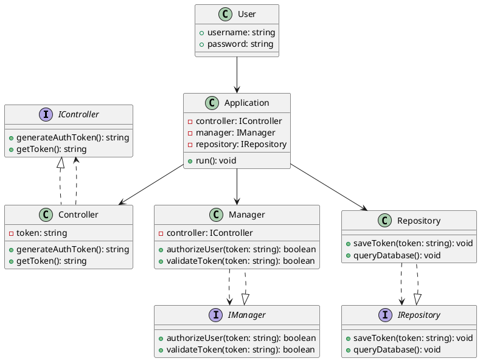
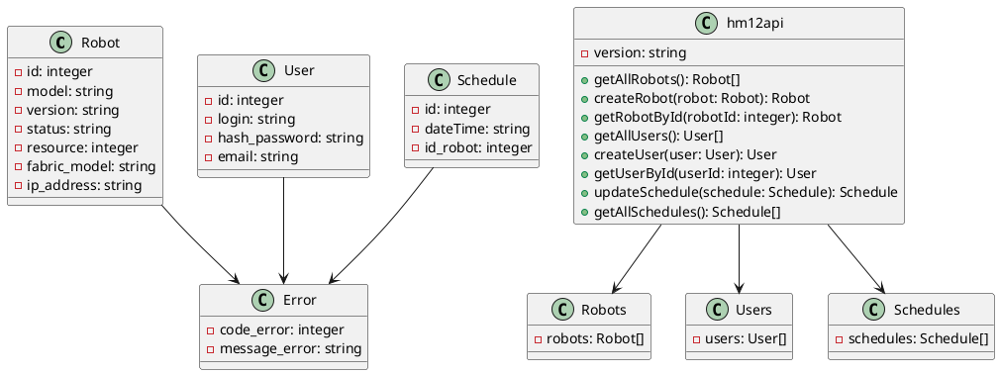

# Homework12

## UML диаграмма авторизации
### код

## Таблица UAT тестов для протокола тестирования клиентского приложения:

| Тестовый сценарий | Описание | Ожидаемый результат |
| --- | --- | --- |
| Пользователь вводит неправильные учетные данные | Пользователь вводит неправильное имя пользователя или пароль | Приложение должно отобразить сообщение об ошибке и предложить повторить попытку входа |
| Пользователь вводит правильные учетные данные | Пользователь вводит правильное имя пользователя и пароль | Приложение должно авторизовать пользователя и открыть главный экран |
| Пользователь запрашивает сброс пароля | Пользователь нажимает на ссылку для сброса пароля | Приложение должно отправить на электронную почту пользователя инструкции по сбросу пароля |
| Пользователь обновляет свой профиль | Пользователь изменяет свои персональные данные | Приложение должно сохранить обновленные данные и отобразить успешное сообщение об обновлении профиля |
| Пользователь выходит из приложения | Пользователь нажимает на кнопку выхода из приложения | Приложение должно разлогинить пользователя и вернуть его на экран входа |

## Таблица E2E тестов для протокола тестирования клиентского приложения

| Шаг | Действие | Ожидаемый результат |
| --- | --- | --- |
| 1 | Запустить клиентское приложение | Приложение успешно запускается без ошибок |
| 2 | Сгенерировать токен с помощью метода generateAuthToken контроллера | Токен успешно сгенерирован |
| 3 | Получить сгенерированный токен с помощью метода getToken контроллера | Получен правильный токен |
| 4 | Авторизовать пользователя с помощью метода authorizeUser менеджера, передавая сгенерированный токен | Пользователь успешно авторизован |
| 5 | Проверить валидность токена с помощью метода validateToken менеджера, передавая сгенерированный токен | Токен является валидным |
| 6 | Сохранить токен в хранилище с помощью метода saveToken репозитория | Токен успешно сохранен |
| 7 | Запросить данные из базы данных с помощью метода queryDatabase репозитория | Данные успешно получены из базы данных |
| 8 | Завершить тестирование приложения | Тестирование завершено успешно |

# UML api

## Таблица UAT тестов для протокола тестирования клиентского приложения

| Тестовый сценарий | Описание | Ожидаемый результат | Результат |
| --- | --- | --- | --- |
| Аутентификация пользователя | Попытка входа в приложение с правильными учетными данными пользователя | Успешная аутентификация и переход на главный экран приложения |  |
| Аутентификация пользователя | Попытка входа в приложение с неправильными учетными данными пользователя | Отображение сообщения об ошибке аутентификации |  |
| Создание робота | Попытка создания нового робота с корректными данными | Успешное создание робота и отображение его в списке роботов |  |
| Создание робота | Попытка создания нового робота с неправильными данными | Отображение сообщения об ошибке создания робота |  |
| Получение информации о роботе | Запрос информации о существующем роботе | Отображение подробной информации о роботе |  |
| Получение информации о роботе | Запрос информации о несуществующем роботе | Отображение сообщения об ошибке получения информации |  |
| Обновление расписания | Попытка обновления расписания для существующего робота | Успешное обновление расписания и отображение изменений |  |
| Обновление расписания | Попытка обновления расписания для несуществующего робота | Отображение сообщения об ошибке обновления расписания |  |
| Получение списка пользователей | Запрос списка всех пользователей | Отображение полного списка пользователей |  |
| Получение списка пользователей | Запрос списка пользователей с неправильными правами доступа | Отображение сообщения об ошибке доступа |  |

## Таблица E2E тестов для протокола тестирования клиентского приложения

| Шаг | Описание | Ожидаемый результат |
| --- | --- | --- |
| 1 | Проверить соединение с API | Успешное подключение |
| 2 | Получить список всех роботов | Список роботов |
| 3 | Создать нового робота | Робот успешно создан |
| 4 | Получить информацию о конкретном роботе по его ID | Информация о роботе |
| 5 | Получить список всех пользователей | Список пользователей |
| 6 | Создать нового пользователя | Пользователь успешно создан |
| 7 | Получить информацию о конкретном пользователе по его ID | Информация о пользователе |
| 8 | Обновить расписание робота | Расписание успешно обновлено |
| 9 | Получить список всех расписаний | Список расписаний |