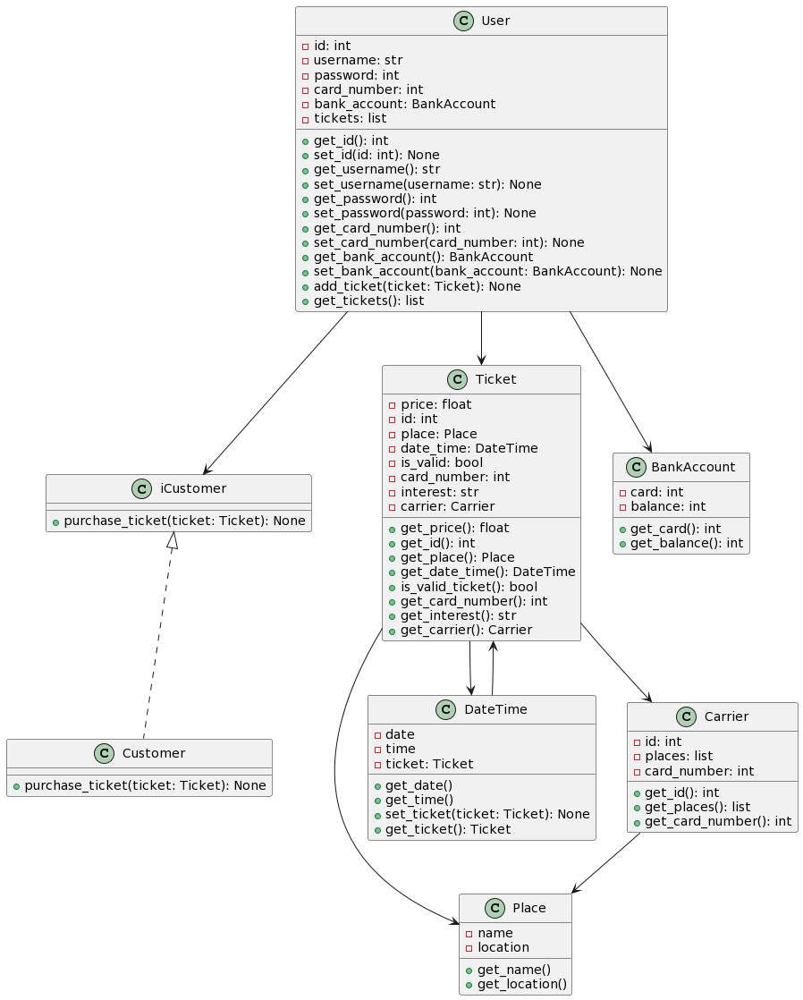

Архитектура ПО (семинары)
Урок 4. Компоненты. Принципы связности и сочетаемости компонентов
Доработать упражнение, начатое на занятии

Код на питоне 

```python

from datetime import datetime
from abc import ABC, abstractmethod


class User:
    def __init__(self, id: int, userName: str, hashPassword: int, cardNumber: int, bankAccount: 'BankAccount'):
        self.id = id
        self.userName = userName
        self.hashPassword = hashPassword
        self.cardNumber = cardNumber
        self.bankAccount = bankAccount
        self.tickets = []

    def get_id(self) -> int:
        return self.id

    def set_id(self, id: int) -> None:
        self.id = id

    def get_user_name(self) -> str:
        return self.userName

    def set_user_name(self, userName: str) -> None:
        self.userName = userName

    def get_hash_password(self) -> int:
        return self.hashPassword

    def set_hash_password(self, hashPassword: int) -> None:
        self.hashPassword = hashPassword

    def get_card_number(self) -> int:
        return self.cardNumber

    def set_card_number(self, cardNumber: int) -> None:
        self.cardNumber = cardNumber

    def get_bank_account(self) -> 'BankAccount':
        return self.bankAccount

    def set_bank_account(self, bankAccount: 'BankAccount') -> None:
        self.bankAccount = bankAccount

    def add_ticket(self, ticket: 'Ticket') -> None:
        self.tickets.append(ticket)

    def get_tickets(self) -> list:
        return self.tickets


class iCustomer(ABC):
    @abstractmethod
    def purchase_ticket(self, ticket: 'Ticket') -> None:
        pass


class Customer(User, iCustomer):
    def __init__(self, id: int, userName: str, hashPassword: int, cardNumber: int, bankAccount: 'BankAccount'):
        super().__init__(id, userName, hashPassword, cardNumber, bankAccount)

    def purchase_ticket(self, ticket: 'Ticket') -> None:
        self.add_ticket(ticket)


class Ticket:
    def __init__(self, price: float, id: int, place: 'Place', dateTime: 'DateTime', is_valid: bool, cardNumber: int,
                 interest: str, carrier: 'Carrier'):
        self.price = price
        self.id = id
        self.place = place
        self.dateTime = dateTime
        self.is_valid = is_valid
        self.cardNumber = cardNumber
        self.interest = interest
        self.carrier = carrier

        self.dateTime.set_ticket(self)

    def get_price(self) -> float:
        return self.price

    def get_id(self) -> int:
        return self.id

    def get_place(self) -> 'Place':
        return self.place

    def get_date_time(self) -> 'DateTime':
        return self.dateTime

    def is_valid(self) -> bool:
        return self.is_valid

    def get_card_number(self) -> int:
        return self.cardNumber

    def get_interest(self) -> str:
        return self.interest

    def get_carrier(self) -> 'Carrier':
        return self.carrier


class BankAccount:
    def __init__(self, card: int, balance: int):
        self.card = card
        self.balance = balance

    def get_card(self) -> int:
        return self.card

    def get_balance(self) -> int:
        return self.balance


class Place:
    def __init__(self, name, location):
        self.name = name
        self.location = location

    def get_name(self):
        return self.name

    def get_location(self):
        return self.location


class DateTime:
    def __init__(self, date, time):
        self.date = date
        self.time = time
        self.ticket = None

    def get_date(self):
        return self.date

    def get_time(self):
        return self.time

    def set_ticket(self, ticket: 'Ticket') -> None:
        self.ticket = ticket

    def get_ticket(self) -> 'Ticket':
        return self.ticket


class Carrier:
    def __init__(self, id: int, places: list, cardNumber: int):
        self.id = id
        self.places = places
        self.cardNumber = cardNumber

    def get_id(self) -> int:
        return self.id

    def get_places(self) -> list:
        return self.places

    def get_card_number(self) -> int:
        return self.cardNumber

```

