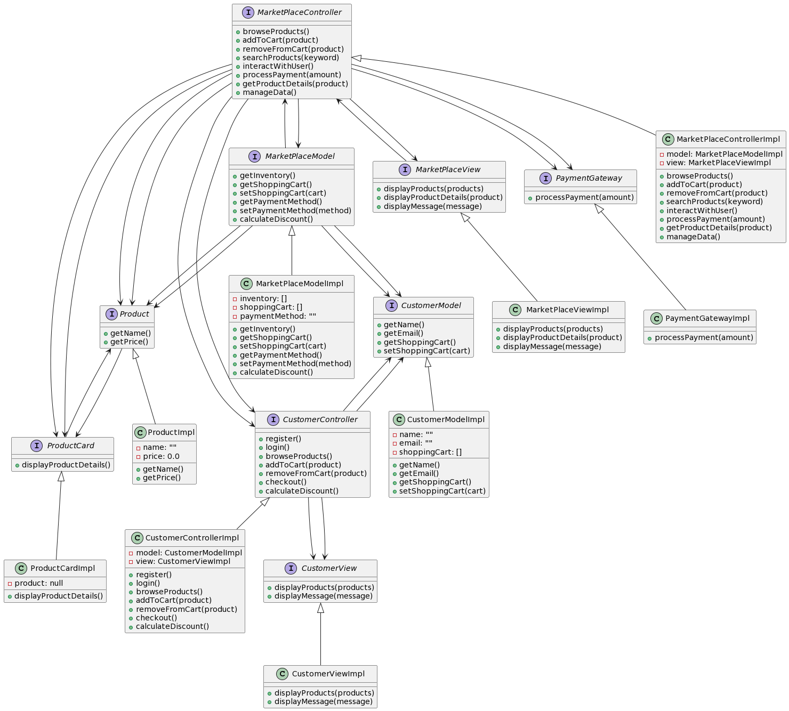
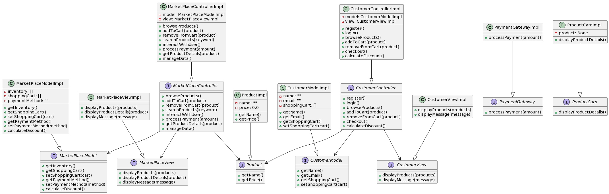

Архитектура ПО (семинары)
Урок 5. Горизонтальные уровни и вертикальные срезы архитектуры
Для любой системы из задания(Редактор 3Д графики, онлайн-редактор) выпустить диаграмму компонент UML.

# Вариант 1 
```python
# Интерфейсы
from abc import ABC, abstractmethod


class MarketPlaceController(ABC):
    """Интерфейс контроллера торговой площадки"""

    @abstractmethod
    def browseProducts(self):
        """Просмотр продуктов"""
        pass

    @abstractmethod
    def addToCart(self, product):
        """Добавление в корзину"""
        pass

    @abstractmethod
    def removeFromCart(self, product):
        """Удаление из корзины"""
        pass

    @abstractmethod
    def searchProducts(self, keyword):
        """Поиск продуктов"""
        pass

    @abstractmethod
    def interactWithUser(self):
        """Взаимодействие с пользователем"""
        pass

    @abstractmethod
    def processPayment(self, amount):
        """Обработка оплаты"""
        pass

    @abstractmethod
    def getProductDetails(self, product):
        """Получение деталей продукта"""
        pass

    @abstractmethod
    def manageData(self):
        """Управление данными"""
        pass


class MarketPlaceModel(ABC):
    """Интерфейс модели торговой площадки"""

    @abstractmethod
    def getInventory(self):
        """Получение инвентаря"""
        pass

    @abstractmethod
    def getShoppingCart(self):
        """Получение корзины"""
        pass

    @abstractmethod
    def setShoppingCart(self, cart):
        """Установка корзины"""
        pass

    @abstractmethod
    def getPaymentMethod(self):
        """Получение метода оплаты"""
        pass

    @abstractmethod
    def setPaymentMethod(self, method):
        """Установка метода оплаты"""
        pass

    @abstractmethod
    def calculateDiscount(self):
        """Расчет скидки"""
        pass


class MarketPlaceView(ABC):
    """Интерфейс представления торговой площадки"""

    @abstractmethod
    def displayProducts(self, products):
        """Отображение продуктов"""
        pass

    @abstractmethod
    def displayProductDetails(self, product):
        """Отображение деталей продукта"""
        pass

    @abstractmethod
    def displayMessage(self, message):
        """Отображение сообщения"""
        pass


class Product(ABC):
    """Интерфейс продукта"""

    @abstractmethod
    def getName(self):
        """Получение названия"""
        pass

    @abstractmethod
    def getPrice(self):
        """Получение цены"""
        pass


class CustomerController(ABC):
    """Интерфейс контроллера клиента"""

    @abstractmethod
    def register(self):
        """Регистрация"""
        pass

    @abstractmethod
    def login(self):
        """Вход"""
        pass

    @abstractmethod
    def browseProducts(self):
        """Просмотр продуктов"""
        pass

    @abstractmethod
    def addToCart(self, product):
        """Добавление в корзину"""
        pass

    @abstractmethod
    def removeFromCart(self, product):
        """Удаление из корзины"""
        pass

    @abstractmethod
    def checkout(self):
        """Оформление заказа"""
        pass

    @abstractmethod
    def calculateDiscount(self):
        """Расчет скидки"""
        pass


class CustomerModel(ABC):
    """Интерфейс модели клиента"""

    @abstractmethod
    def getName(self):
        """Получение имени"""
        pass

    @abstractmethod
    def getEmail(self):
        """Получение адреса электронной почты"""
        pass

    @abstractmethod
    def getShoppingCart(self):
        """Получение корзины"""
        pass

    @abstractmethod
    def setShoppingCart(self, cart):
        """Установка корзины"""
        pass


class CustomerView(ABC):
    """Интерфейс представления клиента"""

    @abstractmethod
    def displayProducts(self, products):
        """Отображение продуктов"""
        pass

    @abstractmethod
    def displayMessage(self, message):
        """Отображение сообщения"""
        pass


class PaymentGateway(ABC):
    """Интерфейс платежного шлюза"""

    @abstractmethod
    def processPayment(self, amount):
        """Обработка платежа"""
        pass


class ProductCard(ABC):
    """Интерфейс карточки продукта"""

    @abstractmethod
    def displayProductDetails(self):
        """Отображение деталей продукта"""
        pass


# Бизнес логика

class MarketPlaceControllerImpl(MarketPlaceController):
    """Реализация контроллера торговой площадки"""

    def __init__(self):
        self.model = MarketPlaceModelImpl()
        self.view = MarketPlaceViewImpl()

    def browseProducts(self):
        pass

    def addToCart(self, product):
        pass

    def removeFromCart(self, product):
        pass

    def searchProducts(self, keyword):
        pass

    def interactWithUser(self):
        pass

    def processPayment(self, amount):
        pass

    def getProductDetails(self, product):
        pass

    def manageData(self):
        pass


class CustomerControllerImpl(CustomerController):
    """Реализация контроллера клиента"""

    def __init__(self):
        self.model = CustomerModelImpl()
        self.view = CustomerViewImpl()

    def register(self):
        pass

    def login(self):
        pass

    def browseProducts(self):
        pass

    def addToCart(self, product):
        pass

    def removeFromCart(self, product):
        pass

    def checkout(self):
        pass

    def calculateDiscount(self):
        pass


# Данные

class MarketPlaceModelImpl(MarketPlaceModel):
    """Реализация модели торговой площадки"""

    def __init__(self):
        self.inventory = []
        self.shoppingCart = []
        self.paymentMethod = ""

    def getInventory(self):
        pass

    def getShoppingCart(self):
        pass

    def setShoppingCart(self, cart):
        pass

    def getPaymentMethod(self):
        pass

    def setPaymentMethod(self, method):
        pass

    def calculateDiscount(self):
        pass


class CustomerModelImpl(CustomerModel):
    """Реализация модели клиента"""

    def __init__(self):
        self.name = ""
        self.email = ""
        self.shoppingCart = []

    def getName(self):
        pass

    def getEmail(self):
        pass

    def getShoppingCart(self):
        pass

    def setShoppingCart(self, cart):
        pass


# Связи

class MarketPlaceViewImpl(MarketPlaceView):
    """Реализация представления торговой площадки"""

    def displayProducts(self, products):
        pass

    def displayProductDetails(self, product):
        pass

    def displayMessage(self, message):
        pass


class ProductImpl(Product):
    """Реализация продукта"""

    def __init__(self):
        self.name = ""
        self.price = 0.0

    def getName(self):
        pass

    def getPrice(self):
        pass


class CustomerViewImpl(CustomerView):
    """Реализация представления клиента"""

    def displayProducts(self, products):
        pass

    def displayMessage(self, message):
        pass


class PaymentGatewayImpl(PaymentGateway):
    """Реализация платежного шлюза"""

    def processPayment(self, amount):
        pass


class ProductCardImpl(ProductCard):
    """Реализация карточки продукта"""

    def __init__(self):
        self.product = None

    def displayProductDetails(self):
        pass


if __name__ == '__main__':
    # Создание экземпляра класса CustomerControllerImpl
    customer_controller = CustomerControllerImpl()

    # Вызов функции register()
    customer_controller.register()

    # Вызов функции login()
    customer_controller.login()

    # Вызов функции browseProducts()
    customer_controller.browseProducts()

    # Создание экземпляра класса Product
    product = ProductImpl()

    # Вызов функции addToCart() с передачей экземпляра класса Product
    customer_controller.addToCart(product)

    # Вызов функции removeFromCart() с передачей экземпляра класса Product
    customer_controller.removeFromCart(product)

    # Вызов функции checkout()
    customer_controller.checkout()

    # Вызов функции calculateDiscount()
    customer_controller.calculateDiscount()

    # Создание экземпляра класса MarketPlaceControllerImpl
    marketplace_controller = MarketPlaceControllerImpl()

    # Вызов функции browseProducts()
    marketplace_controller.browseProducts()

    # Вызов функции addToCart() с передачей экземпляра класса Product
    marketplace_controller.addToCart(product)

    # Вызов функции removeFromCart() с передачей экземпляра класса Product
    marketplace_controller.removeFromCart(product)

    # Вызов функции searchProducts() с передачей ключевого слова
    marketplace_controller.searchProducts("keyword")

    # Вызов функции interactWithUser()
    marketplace_controller.interactWithUser()

    # Вызов функции processPayment() с передачей суммы
    marketplace_controller.processPayment(100)

    # Вызов функции getProductDetails() с передачей экземпляра класса Product
    marketplace_controller.getProductDetails(product)

    # Вызов функции manageData()
    marketplace_controller.manageData()

    # Создание экземпляра класса MarketPlaceModelImpl
    marketplace_model = MarketPlaceModelImpl()

    # Вызов функции getInventory()
    marketplace_model.getInventory()

    # Вызов функции getShoppingCart()
    marketplace_model.getShoppingCart()

    # Вызов функции setShoppingCart() с передачей корзины
    marketplace_model.setShoppingCart([])

    # Вызов функции getPaymentMethod()
    marketplace_model.getPaymentMethod()

    # Вызов функции setPaymentMethod() с передачей метода оплаты
    marketplace_model.setPaymentMethod("method")

    # Вызов функции calculateDiscount()
    marketplace_model.calculateDiscount()

    # Создание экземпляра класса CustomerModelImpl
    customer_model = CustomerModelImpl()

    # Вызов функции getName()
    customer_model.getName()

    # Вызов функции getEmail()
    customer_model.getEmail()

    # Вызов функции getShoppingCart()
    customer_model.getShoppingCart()

    # Вызов функции setShoppingCart() с передачей корзины
    customer_model.setShoppingCart([])

    # Создание экземпляра класса MarketPlaceViewImpl
    marketplace_view = MarketPlaceViewImpl()

    # Вызов функции displayProducts() с передачей списка продуктов
    marketplace_view.displayProducts([])

    # Вызов функции displayProductDetails() с передачей экземпляра класса Product
    marketplace_view.displayProductDetails(product)

    # Вызов функции displayMessage() с передачей сообщения
    marketplace_view.displayMessage("message")

    # Создание экземпляра класса CustomerViewImpl
    customer_view = CustomerViewImpl()

    # Вызов функции displayProducts() с передачей списка продуктов
    customer_view.displayProducts([])

    # Вызов функции displayMessage() с передачей сообщения
    customer_view.displayMessage("message")

    # Создание экземпляра класса PaymentGatewayImpl
    payment_gateway = PaymentGatewayImpl()

```


# Вариант 2

```python
# Интерфейсы
from abc import ABC, abstractmethod


class MarketPlaceController(ABC):
    """Интерфейс контроллера торговой площадки"""

    @abstractmethod
    def browseProducts(self):
        """Просмотр продуктов"""
        pass

    @abstractmethod
    def addToCart(self, product):
        """Добавление в корзину"""
        pass

    @abstractmethod
    def removeFromCart(self, product):
        """Удаление из корзины"""
        pass

    @abstractmethod
    def searchProducts(self, keyword):
        """Поиск продуктов"""
        pass

    @abstractmethod
    def interactWithUser(self):
        """Взаимодействие с пользователем"""
        pass

    @abstractmethod
    def processPayment(self, amount):
        """Обработка оплаты"""
        pass

    @abstractmethod
    def getProductDetails(self, product):
        """Получение деталей продукта"""
        pass

    @abstractmethod
    def manageData(self):
        """Управление данными"""
        pass


class MarketPlaceModel(ABC):
    """Интерфейс модели торговой площадки"""

    @abstractmethod
    def getInventory(self):
        """Получение инвентаря"""
        pass

    @abstractmethod
    def getShoppingCart(self):
        """Получение корзины"""
        pass

    @abstractmethod
    def setShoppingCart(self, cart):
        """Установка корзины"""
        pass

    @abstractmethod
    def getPaymentMethod(self):
        """Получение метода оплаты"""
        pass

    @abstractmethod
    def setPaymentMethod(self, method):
        """Установка метода оплаты"""
        pass

    @abstractmethod
    def calculateDiscount(self):
        """Расчет скидки"""
        pass


class MarketPlaceView(ABC):
    """Интерфейс представления торговой площадки"""

    @abstractmethod
    def displayProducts(self, products):
        """Отображение продуктов"""
        pass

    @abstractmethod
    def displayProductDetails(self, product):
        """Отображение деталей продукта"""
        pass

    @abstractmethod
    def displayMessage(self, message):
        """Отображение сообщения"""
        pass


class Product(ABC):
    """Интерфейс продукта"""

    @abstractmethod
    def getName(self):
        """Получение названия"""
        pass

    @abstractmethod
    def getPrice(self):
        """Получение цены"""
        pass


class CustomerController(ABC):
    """Интерфейс контроллера клиента"""

    @abstractmethod
    def register(self):
        """Регистрация"""
        pass

    @abstractmethod
    def login(self):
        """Вход"""
        pass

    @abstractmethod
    def browseProducts(self):
        """Просмотр продуктов"""
        pass

    @abstractmethod
    def addToCart(self, product):
        """Добавление в корзину"""
        pass

    @abstractmethod
    def removeFromCart(self, product):
        """Удаление из корзины"""
        pass

    @abstractmethod
    def checkout(self):
        """Оформление заказа"""
        pass

    @abstractmethod
    def calculateDiscount(self):
        """Расчет скидки"""
        pass


class CustomerModel(ABC):
    """Интерфейс модели клиента"""

    @abstractmethod
    def getName(self):
        """Получение имени"""
        pass

    @abstractmethod
    def getEmail(self):
        """Получение адреса электронной почты"""
        pass

    @abstractmethod
    def getShoppingCart(self):
        """Получение корзины"""
        pass

    @abstractmethod
    def setShoppingCart(self, cart):
        """Установка корзины"""
        pass


class CustomerView(ABC):
    """Интерфейс представления клиента"""

    @abstractmethod
    def displayProducts(self, products):
        """Отображение продуктов"""
        pass

    @abstractmethod
    def displayMessage(self, message):
        """Отображение сообщения"""
        pass


class PaymentGateway(ABC):
    """Интерфейс платежного шлюза"""

    @abstractmethod
    def processPayment(self, amount):
        """Обработка платежа"""
        pass


class ProductCard(ABC):
    """Интерфейс карточки продукта"""

    @abstractmethod
    def displayProductDetails(self):
        """Отображение деталей продукта"""
        pass


# Бизнес логика

class MarketPlaceControllerImpl(MarketPlaceController):
    """Реализация контроллера торговой площадки"""

    def __init__(self):
        self.model = MarketPlaceModelImpl()
        self.view = MarketPlaceViewImpl()

    def browseProducts(self):
        pass

    def addToCart(self, product):
        pass

    def removeFromCart(self, product):
        pass

    def searchProducts(self, keyword):
        pass

    def interactWithUser(self):
        pass

    def processPayment(self, amount):
        pass

    def getProductDetails(self, product):
        pass

    def manageData(self):
        pass


class CustomerControllerImpl(CustomerController):
    """Реализация контроллера клиента"""

    def __init__(self):
        self.model = CustomerModelImpl()
        self.view = CustomerViewImpl()

    def register(self):
        pass

    def login(self):
        pass

    def browseProducts(self):
        pass

    def addToCart(self, product):
        pass

    def removeFromCart(self, product):
        pass

    def checkout(self):
        pass

    def calculateDiscount(self):
        pass


# Данные

class MarketPlaceModelImpl(MarketPlaceModel):
    """Реализация модели торговой площадки"""

    def __init__(self):
        self.inventory = []
        self.shoppingCart = []
        self.paymentMethod = ""

    def getInventory(self):
        pass

    def getShoppingCart(self):
        pass

    def setShoppingCart(self, cart):
        pass

    def getPaymentMethod(self):
        pass

    def setPaymentMethod(self, method):
        pass

    def calculateDiscount(self):
        pass


class CustomerModelImpl(CustomerModel):
    """Реализация модели клиента"""

    def __init__(self):
        self.name = ""
        self.email = ""
        self.shoppingCart = []

    def getName(self):
        pass

    def getEmail(self):
        pass

    def getShoppingCart(self):
        pass

    def setShoppingCart(self, cart):
        pass


# Связи

class MarketPlaceViewImpl(MarketPlaceView):
    """Реализация представления торговой площадки"""

    def displayProducts(self, products):
        pass

    def displayProductDetails(self, product):
        pass

    def displayMessage(self, message):
        pass


class ProductImpl(Product):
    """Реализация продукта"""

    def __init__(self):
        self.name = ""
        self.price = 0.0

    def getName(self):
        pass

    def getPrice(self):
        pass


class CustomerViewImpl(CustomerView):
    """Реализация представления клиента"""

    def displayProducts(self, products):
        pass

    def displayMessage(self, message):
        pass


class PaymentGatewayImpl(PaymentGateway):
    """Реализация платежного шлюза"""

    def processPayment(self, amount):
        pass


class ProductCardImpl(ProductCard):
    """Реализация карточки продукта"""

    def __init__(self):
        self.product = None

    def displayProductDetails(self):
        pass


```

